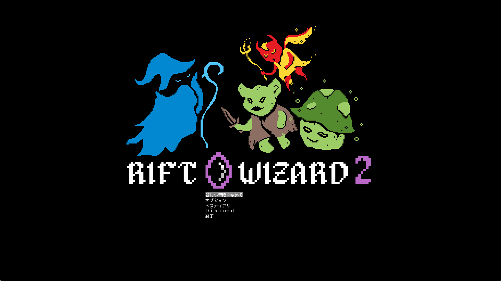
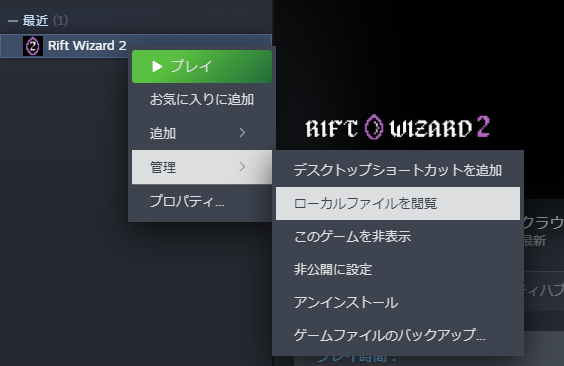
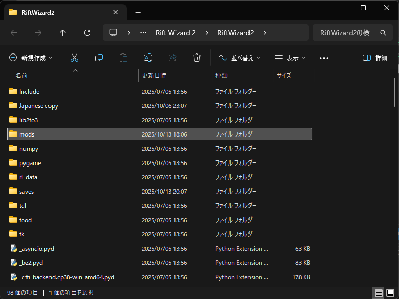
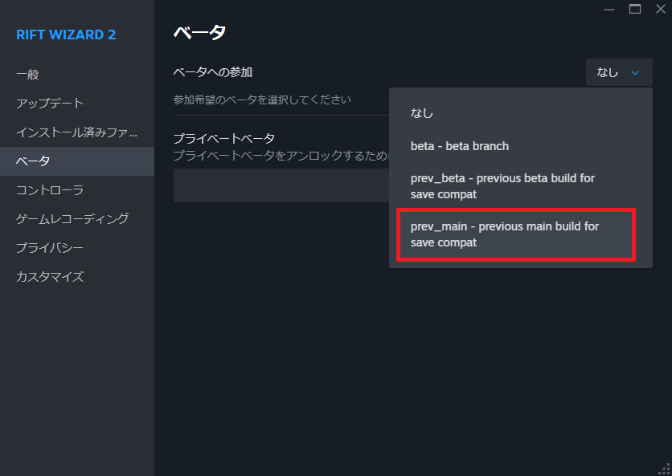

# Rift Wizard 2 日本語化MOD

[Rift Wizard 2](https://store.steampowered.com/app/2058570/Rift_Wizard_2/)の日本語化MODです。

2025年10月15日に公開された Patch 3 に対応しています。

# 導入方法

[Releases](../../releases/latest)のページから、最新バージョンの Assets にある Japanese.zip をダウンロードしてください。

ダウンロードしたZipファイルを展開し、Rift Wizard 2をインストールしたフォルダ内の「mods」フォルダの中に配置してください。

Modをアンインストールする際は「Japanese」フォルダを削除してください。Mod適用中に開始した冒険のセーブデータをアンインストール後に使用することはできません。

# 困ったことがあったら

Rift Wizard 2に最新のパッチが出たことで不具合が発生する場合、Rift Wizard 2を前のバージョンに戻すことで起動可能になります。

Steam上で Rift Wizard 2 を右クリックして「プロパティ」から「ベータ」内で「ベータへの参加」の一番下の「prev_main」を選んで一つ前のバージョンで起動してください。

それ以外の状況で不具合がある場合、[@theki](https://x.com/theki)までご連絡いただければ、可能な範囲内で対応します。
- 翻訳漏れについては、ゲームと同時に立ち上がるコンソール画面に表示されているエラーメッセージを送ってください。
- ゲーム起動中に強制終了する場合は、Rift Wizard 2のフォルダ内にある「crash.txt」を送ってください。

# License

These codes are licensed under CC0.

